<!-- Generated by Qadar from 27 source file(s) on 22/05/2026, 3:19:12 AM. Derived from the project's real code — regenerate after changes. -->

# Page Flow

Solo Shop Builder is a private e-commerce platform for micro-sellers. Unauthenticated users land on a marketing/home page (`/`) and may sign in or register via `/auth/login`. From there the auth flow branches into magic-link verification (`/auth/verify`), password reset (`/auth/forgot-password` → `/auth/reset-password`), and on success the seller reaches the central `/dashboard`. The dashboard links outward to seven sub-sections (Products, Orders, Analytics, Branding, Profile, Billing, Email Templates, Settings, CSV Import). Buyers browse a shop storefront (`/shop/[slug]`), add items to a cart, proceed to `/checkout`, then land on `/checkout/success`. Several navigations are performed via `router.push(...)`, `redirect(...)`, or `<a href>`/`<Link href>` as noted below.

## Diagram

```mermaid
flowchart TD
    HOME["/"]
    LOGIN["/auth/login"]
    FORGOT["/auth/forgot-password"]
    RESET["/auth/reset-password"]
    VERIFY["/auth/verify"]
    DASHBOARD["/dashboard"]
    CREATE_SHOP["/dashboard/create-shop"]
    PRODUCTS["/dashboard/products"]
    PRODUCT_EDIT["/dashboard/products/[id]/edit"]
    PRODUCT_IMPORT["/dashboard/products/import"]
    ORDERS["/dashboard/orders"]
    ORDER_DETAIL["/dashboard/orders/[id]"]
    ANALYTICS["/dashboard/analytics"]
    BRANDING["/dashboard/branding"]
    PROFILE["/dashboard/profile"]
    BILLING["/dashboard/billing"]
    EMAIL_TEMPLATE["/dashboard/email-template"]
    SETTINGS["/dashboard/settings"]
    SHOP["/shop/[slug]"]
    CHECKOUT["/checkout"]
    SUCCESS["/checkout/success"]

    HOME -->|"Learn more link"| LOGIN

    LOGIN -->|"submit password login"| DASHBOARD
    LOGIN -->|"Forgot your password?"| FORGOT
    LOGIN -->|"Learn more"| HOME

    FORGOT -->|"Back to Sign In"| LOGIN

    RESET -->|"invalid token: Request new reset link"| FORGOT
    RESET -->|"Back to Sign In"| LOGIN
    RESET -->|"submit success (setTimeout)"| LOGIN

    VERIFY -->|"success, hasShop=true (router.push)"| DASHBOARD
    VERIFY -->|"success, hasShop=false (router.push)"| CREATE_SHOP
    VERIFY -->|"error: Back to Login (router.push)"| LOGIN

    DASHBOARD -->|"redirect: no session"| LOGIN
    DASHBOARD -->|"redirect: no shop"| CREATE_SHOP
    DASHBOARD -->|"View Storefront (Link)"| SHOP
    DASHBOARD -->|"Manage Products (Link)"| PRODUCTS
    DASHBOARD -->|"Products card (Link)"| PRODUCTS
    DASHBOARD -->|"Orders card (Link)"| ORDERS
    DASHBOARD -->|"Analytics card (Link)"| ANALYTICS
    DASHBOARD -->|"Branding card (Link)"| BRANDING
    DASHBOARD -->|"Profile card (Link)"| PROFILE
    DASHBOARD -->|"Billing card (Link)"| BILLING
    DASHBOARD -->|"Email Templates card (Link)"| EMAIL_TEMPLATE
    DASHBOARD -->|"Settings card (Link)"| SETTINGS
    DASHBOARD -->|"CSV Import card (Link)"| PRODUCT_IMPORT
    DASHBOARD -->|"Logout POST"| LOGIN

    CREATE_SHOP -->|"auth check fails (router.push)"| LOGIN
    CREATE_SHOP -->|"submit success (setTimeout router.push)"| DASHBOARD
    CREATE_SHOP -->|"Back button (router.back)"| DASHBOARD

    PRODUCTS -->|"Back to Products (router.push)"| PRODUCT_EDIT
    PRODUCT_EDIT -->|"submit success (router.push)"| PRODUCTS
    PRODUCT_EDIT -->|"Back to Products (router.push)"| PRODUCTS
    PRODUCT_EDIT -->|"error state: Back to Products"| PRODUCTS

    ORDERS -->|"Back to Dashboard"| DASHBOARD
    ORDERS -->|"order row click"| ORDER_DETAIL

    ORDER_DETAIL -->|"Back to Orders (router.push)"| ORDERS

    ANALYTICS -->|"Back to Dashboard"| DASHBOARD

    BRANDING -->|"Back to Dashboard (router.push)"| DASHBOARD

    BILLING -->|"Back to Dashboard"| DASHBOARD

    EMAIL_TEMPLATE -->|"Back to Dashboard (router.push)"| DASHBOARD

    SHOP -->|"CartButton: Proceed to Checkout (Link)"| CHECKOUT

    CHECKOUT -->|"cart empty: Continue shopping (router.push)"| HOME
    CHECKOUT -->|"payment redirect (window.location.href)"| SHOP

    SUCCESS -->|"invalid session: Go home (router.push)"| HOME
    SUCCESS -->|"Back to Shop (router.push)"| SHOP
```

## Pages

- **`/`** — Marketing/home page; linked to from login ("Learn more") and checkout empty-cart fallback. Destinations: `/auth/login`.
- **`/auth/login`** — Sign-in / magic-link signup form. Links to: `/dashboard` (password login success), `/auth/forgot-password` (forgot password link), `/` (Learn more).
- **`/auth/forgot-password`** — Request a password-reset email. Links to: `/auth/login` (Back to Sign In, both pre- and post-submit states).
- **`/auth/reset-password`** — Set a new password using a URL token. Links to: `/auth/forgot-password` (invalid/missing token), `/auth/login` (Back to Sign In; also auto-redirects after success).
- **`/auth/verify`** — Magic-link email verification handler. Redirects to: `/dashboard` (if seller has a shop), `/dashboard/create-shop` (if no shop), `/auth/login` (error state).
- **`/dashboard`** — Seller hub; server-side auth guard. Redirects to `/auth/login` (no session) or `/dashboard/create-shop` (no shop). Links to: `/shop/[slug]`, `/dashboard/products`, `/dashboard/orders`, `/dashboard/analytics`, `/dashboard/branding`, `/dashboard/profile`, `/dashboard/billing`, `/dashboard/email-template`, `/dashboard/settings`, `/dashboard/products/import`. Logout posts to `/api/auth/logout`.
- **`/dashboard/create-shop`** — Shop creation wizard. Redirects to `/auth/login` on auth failure; on success redirects to `/dashboard`.
- **`/dashboard/products`** — Product list management. Links to: `/dashboard/products/[id]/edit` (per-product edit).
- **`/dashboard/products/[id]/edit`** — Edit a single product. Links to: `/dashboard/products` (back, cancel, and on save success).
- **`/dashboard/products/import`** — Bulk CSV import for products. No outbound navigation links detected in provided source.
- **`/dashboard/orders`** — Orders list with filters. "Back to Dashboard" → `/dashboard`; individual order rows → `/dashboard/orders/[id]`.
- **`/dashboard/orders/[id]`** — Order detail with status update and refund. Server-side auth guard redirects to `/auth/login` or `/dashboard/create-shop`. "Back to Orders" → `/dashboard/orders`.
- **`/dashboard/analytics`** — Revenue/order analytics charts. "Back to Dashboard" → `/dashboard`.
- **`/dashboard/branding`** — Shop colour and logo customisation. "Back to Dashboard" → `/dashboard`.
- **`/dashboard/profile`** — Seller bio and contact info. No outbound navigation links detected in provided source.
- **`/dashboard/billing`** — Transaction history and fee breakdown. "Back to Dashboard" → `/dashboard`.
- **`/dashboard/email-template`** — Order-confirmation email editor. "Back to Dashboard" → `/dashboard`.
- **`/dashboard/settings`** — Account and shop settings. No source file provided; linked to from dashboard.
- **`/shop/[slug]`** — Public buyer-facing storefront. `CartButton` links to `/checkout`.
- **`/checkout`** — Cart review and payment initiation. Empty-cart state → `/` (router.push). On payment provider redirect, `window.location.href` sends buyer off-site (Stripe / MyFatoorah). Error query-param recovery stays on `/checkout`.
- **`/checkout/success`** — Post-payment confirmation and receipt. Invalid session → `/` (router.push). "Back to Shop" → `/shop/[slug]` (router.push using saved cart slug).

## Notes

- **`/dashboard/profile`** and **`/dashboard/settings`** are linked from the dashboard grid but their source files were not included in the analysed set; their internal navigation cannot be confirmed.
- **`/dashboard/products/import`** source was not provided; only the dashboard link to it is confirmed.
- The `CartButton` component's `<Link href="/checkout">` is rendered inside shop pages, so the `/shop/[slug]` → `/checkout` edge is inferred from the component rather than a dedicated shop page file.
- The `window.location.href = redirectUrl` in `/checkout` points to an external Stripe or MyFatoorah URL, not an internal page; this is not shown as an internal edge.
- `/checkout/success` resolves the shop slug from the cart (saved before clearing) to construct a `router.push` to `/shop/[slug]`; if the slug is absent the fallback is `/` via "Go home".
- The "Export as CSV" button on `/dashboard/orders` calls `window.location.href = '/api/orders/export'`, which is an API route, not a page, and is excluded from the diagram.
